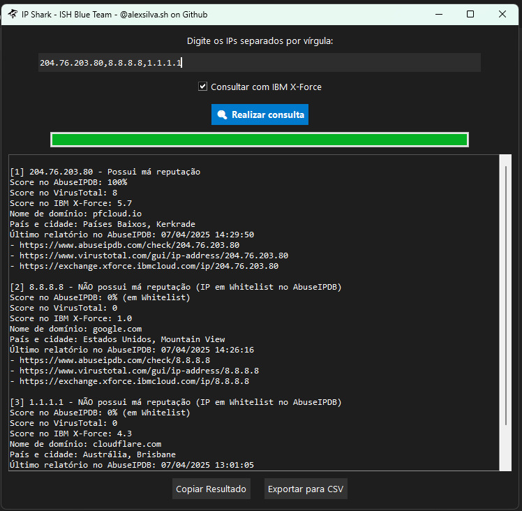

# IPshark

## Consulta de Reputação com IPshark

IPshark é uma ferramenta Python robusta e intuitiva para analisar a reputação de endereços IP e hashes, integrando múltiplas fontes de inteligência de ameaças. Utilizando as APIs do AbuseIPDB, VirusTotal, AlienVault e IBM X-Force (via web scraping com Selenium), além de informações de geolocalização do IPinfo, o IPshark oferece uma visão abrangente da reputação de um IP através de uma interface gráfica amigável. Os resultados podem ser visualizados direto na interface e opcionalmente salvos em um arquivo CSV.

## Funcionalidades Principais

* **Consulta de Reputação Multi-Fonte:**
    * **AbuseIPDB:** Obtém informações de relatórios de abuso de IP.
    * **VirusTotal:** Analisa a reputação do IP ou hash com base em múltiplos antivírus e scanners de malware.
    * **IBM X-Force:** Consulta a pontuação de risco do IP através de web scraping.
    * **AlienVault:** Analisa a reputação da hash.
* **Geolocalização Avançada:** Determina a localização do IP (cidade e país) usando a API IPinfo.io.
* **Tradução de Países:** Traduz nomes de países para português utilizando uma API dedicada.
* **Geração de CSV:** Salva os resultados detalhados em um arquivo CSV para análise e relatórios futuros.
* **Verificação de Whitelisting (AbuseIPDB):** Indica se um IP está na lista de permissões do AbuseIPDB.
* **Formatação de Tempo:** Exibe a data da última denúncia no fuso horário de Brasília.
* **Execução Paralela:** Utiliza threads para realizar consultas ao AbuseIPDB e VirusTotal simultaneamente, acelerando o processo.
* **Carregamento de Chaves de API via `.env`:** Permite armazenar suas chaves de API de forma segura em um arquivo `.env`.
* **Validação de IPs:** Garante que os endereços IP inseridos sejam válidos e públicos.

## Obtenha as Chaves de API

Para utilizar o IPshark em sua totalidade, você precisará das chaves de API dos seguintes serviços:

* **VirusTotal:** [https://www.virustotal.com/gui/home/upload](https://www.virustotal.com/gui/home/upload)
* **AbuseIPDB:** [https://www.abuseipdb.com/account/api](https://www.abuseipdb.com/account/api)
* **IPinfo:** [https://ipinfo.io/signup](https://ipinfo.io/signup)
* **AlienVault:** [https://otx.alienvault.com/api](https://otx.alienvault.com/api)

## Como Usar

**Faça o download dos arquivos `api.env`, `ipshark.exe` e `shark.ico`.**
* No arquivo chamado `api.env` no mesmo diretório do script, edite com bloco de notas para inserir suas chaves em:
* `ABUSEIPDB_API_KEY=sua_api`
* `VIRUSTOTAL_API_KEY=sua_api`
* `IPINFO_API_KEY=sua_api`
* `ALIENVAULT_API_KEY=sua_api`

**Execute o ipshark.exe:**
  - Digite os IPs na caixa de texto, separados por vírgula.
    - Marque a opção "Consultar com IBM X-Force" se desejar incluir essa análise.
    - Clique em "🔍 Realizar consulta".
    - Os resultados serão exibidos na área de saída.
    - Utilize os botões para copiar os resultados ou exportá-los para um arquivo CSV.
   
**Demonstração**

