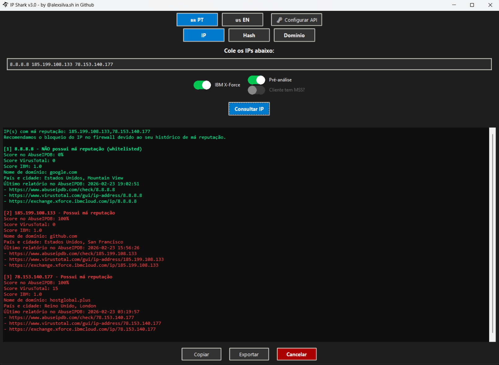

# 🦈 IP Shark v2.4.7

Ferramenta Python com interface gráfica (modo escuro) para análise de reputação de IPs, hashes e URLs, integrando múltiplas fontes de inteligência de ameaças.
O IP Shark combina consultas em AbuseIPDB, VirusTotal, IBM X-Force, AlienVault, IPinfo e JoeSandbox, com execução paralela, exportação de resultados e geração de recomendações automáticas.
---

## 🔍 Funcionalidades Principais

### ✅ Análise de IPs
- **AbuseIPDB**: Score de abuso, data da última denúncia e detecção de whitelist..
- **VirusTotal**: Verificação em múltiplos motores antivírus.
- **IBM X-Force**: Score de risco (consulta automatizada via Selenium).
- **IPinfo**: Localização do IP (cidade e país).
- Tradução automática de países via API Countries.
- Exportação CSV com links diretos para todas as plataformas.
- Pré-análise automática que recomenda bloqueio ou reporte ao MSS.

### 🧪 Análise de Hashes (MD5, SHA1, SHA256)
- **VirusTotal**: Score, nome do arquivo, data da última análise.
- **IBM X-Force**: Nível de risco.
- **AlienVault**: Quantidade de pulsos relacionados.
- **JoeSandbox**: Detecção de relatórios disponíveis.
- **Exportação CSV** com todos os links.
- **Pré-análise com recomendações automáticas**.

### 🌐 Análise de URLs
- **VirusTotal**: Score de reputação.
- **IBM X-Force**: Score da URL (via Selenium).
- **AlienVault**: Quantidade de pulsos relacionados à URL.
- **Exportação CSV** com links.
- Resolução automática de IPs associados usando o DNS público do Google (https://dns.google/resolve) e socket.gethostbyname_ex().
- Pré-análise automática com recomendações de bloqueio ou inspeção.

---

## ⚙️ Recursos Adicionais
- Interface moderna com modo escuro total.
- Execução paralela com status dinâmico das consultas.
- Abas dedicadas para IP, Hash e URL.
- Gerenciamento automático do ChromeDriver, com fechamento completo dos processos ao encerrar o programa.
- Atualização automática: verificação de nova versão no GitHub.
- Entrada flexível — aceita vírgulas, espaços ou quebras de linha.

---

## 🔐 Configuração de APIs

Crie (ou edite) o arquivo chamado `.env` no diretório `config` com o seguinte conteúdo:  
`ABUSEIPDB_API_KEY=xxxxx`  
`VIRUSTOTAL_API_KEY=xxxxx`  
`IPINFO_API_KEY=xxxxx`  
`ALIENVAULT_API_KEY=xxxxx`  

Você pode obter suas chaves nos links abaixo:

- [VirusTotal](https://www.virustotal.com/gui/home/upload)
- [AbuseIPDB](https://www.abuseipdb.com/account/api)
- [IPinfo](https://ipinfo.io/signup)
- [AlienVault](https://otx.alienvault.com/api)

**Execute o ipshark.exe:**
1. Execute ipshark.exe (ou python ip_checker_gui_dark.py se estiver em ambiente Python).
2. Escolha a aba IP, Hash ou URL.
3. Cole os valores a serem consultados (separados por vírgula, espaço ou quebra de linha).
4. Marque as opções desejadas (“IBM X-Force”, “Pré-análise”, “Cliente tem MSS?”).
5. Clique em 🔍 Consultar para iniciar.
6. Os resultados aparecerão na área de saída e poderão ser:
   - Copiados para a área de transferência;
   - Exportados para CSV;
   - Interrompidos a qualquer momento.
   
**Demonstração**

