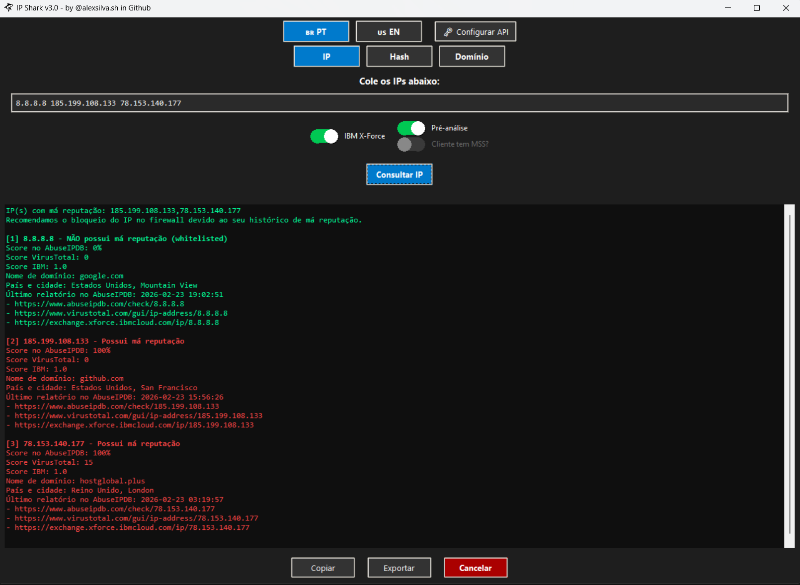

# 🦈 IP Shark
[](LICENSE)
[](https://github.com/alexsilva-sh/IP-Shark/issues)
[](https://github.com/alexsilva-sh/IP-Shark/pulls)

Ferramenta Python com interface gráfica para análise de reputação de IPs, hashes e domínios, integrando múltiplas fontes de inteligência de ameaças.

O IP Shark combina consultas em AbuseIPDB, VirusTotal, IBM X-Force, AlienVault, IPinfo e JoeSandbox, com execução paralela, exportação de resultados em Excel e geração de recomendações automáticas.

---

## 🔍 Funcionalidades Principais

### ✅ Análise de IPs
- **AbuseIPDB**: Score de abuso, data da última denúncia e detecção de whitelist.
- **VirusTotal**: Verificação em múltiplos motores antivírus.
- **IBM X-Force**: Score de risco (consulta automatizada via Selenium).
- **IPinfo**: Localização do IP (cidade e país) com tradução automática do nome do país.
- Execução paralela com até 10 IPs simultâneos e exibição ordenada dos resultados.
- Exportação em **Excel (.xlsx)** com formatação profissional e links diretos para todas as plataformas.
- Pré-análise automática que recomenda bloqueio ou reporte ao MSS.

### 🧪 Análise de Hashes (MD5, SHA1, SHA256)
- **VirusTotal**: Score, nome do arquivo e data da última análise.
- **IBM X-Force**: Nível de risco do hash.
- **AlienVault**: Quantidade de pulsos de ameaça relacionados.
- **JoeSandbox**: Detecção de relatórios de sandbox disponíveis.
- Exportação em **Excel (.xlsx)** com todos os links.
- Pré-análise com recomendações automáticas.

### 🌐 Análise de Domínios
- **VirusTotal**: Score de reputação do domínio.
- **IBM X-Force**: Score do domínio (via Selenium).
- **AlienVault**: Quantidade de pulsos relacionados ao domínio.
- Resolução automática de IPs associados via DNS público do Google (`dns.google/resolve`) e `socket.gethostbyname_ex()`, com análise completa de cada IP resolvido.
- Exportação em **Excel (.xlsx)** com abas separadas: uma para domínios e uma por domínio contendo os IPs associados.
- Pré-análise automática com recomendações de bloqueio ou inspeção.

---

## ⚙️ Recursos Adicionais
- Interface moderna com **modo escuro total** e toggle switches animados.
- **Suporte a dois idiomas**: Português 🇧🇷 e Inglês 🇺🇸, alternável em tempo real.
- Execução paralela com status dinâmico das consultas em andamento.
- Abas dedicadas para **IP**, **Hash** e **Domínio**.
- Gerenciamento automático do ChromeDriver com pool de drivers e fechamento completo dos processos ao encerrar.
- Verificação automática de nova versão no GitHub ao iniciar.
- Botão de atalho para abrir e editar o arquivo `api.env` diretamente pela interface.
- Entrada flexível — aceita vírgulas, espaços ou quebras de linha.
- Resultados coloridos: 🔴 vermelho para reputação ruim, 🟢 verde para limpo.

---

## 🔐 Configuração de APIs

Crie (ou edite) o arquivo `api.env` no diretório `config/` com o seguinte conteúdo:

```
ABUSEIPDB_API_KEY=xxxxx
VIRUSTOTAL_API_KEY=xxxxx
IPINFO_API_KEY=xxxxx
ALIENVAULT_API_KEY=xxxxx
```

> Você também pode clicar no botão **⚙️ Configurar APIs** diretamente na interface para abrir o arquivo.

Obtenha suas chaves gratuitas nos links abaixo:
- [VirusTotal](https://www.virustotal.com/gui/home/upload)
- [AbuseIPDB](https://www.abuseipdb.com/account/api)
- [IPinfo](https://ipinfo.io/signup)
- [AlienVault](https://otx.alienvault.com/api)

---

## 🚀 Como usar

1. Execute `ipshark.exe` (ou `python ip_checker_gui_dark.py` em ambiente Python).
2. Selecione o idioma desejado: 🇧🇷 PT ou 🇺🇸 EN.
3. Escolha a aba **IP**, **Hash** ou **Domínio**.
4. Cole os valores a serem consultados (separados por vírgula, espaço ou quebra de linha).
5. Configure as opções com os toggles disponíveis:
   - **IBM X-Force**: ativa/desativa a consulta ao IBM X-Force.
   - **Pré-análise**: gera recomendação automática ao final da varredura.
   - **Cliente tem MSS?**: ajusta o texto da recomendação para incluir reporte ao MSS.
   - **Verificar IPs associados** *(somente aba Domínio)*: resolve e analisa os IPs de cada domínio.
6. Clique em **🔍 Consultar** para iniciar.
7. Os resultados aparecem na área de saída colorida e podem ser:
   - **Copiados** para a área de transferência;
   - **Exportados** para Excel (.xlsx) com formatação profissional;
   - **Cancelados** a qualquer momento com o botão ❌ Cancelar.

---

**Demonstração**


