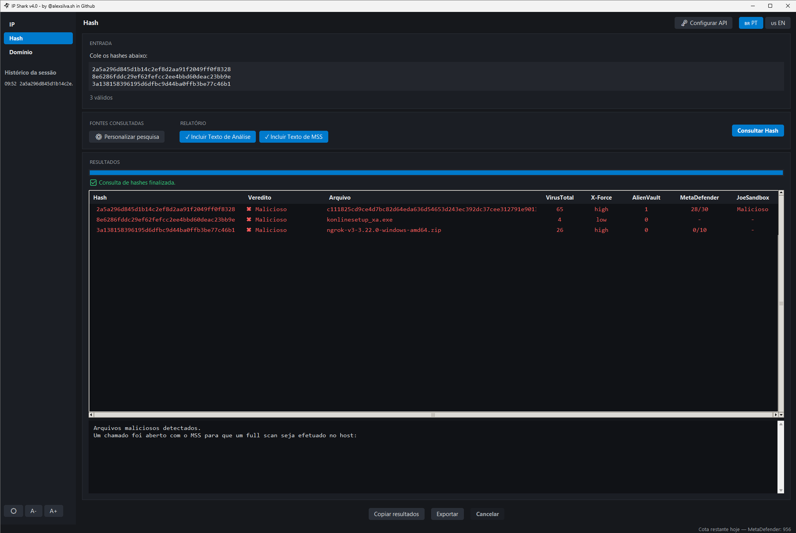

# 🦈 IP Shark
[](LICENSE)
[](https://github.com/alexsilva-sh/IP-Shark/issues)
[](https://github.com/alexsilva-sh/IP-Shark/pulls)

Ferramenta Python com interface gráfica para análise de reputação de IPs, hashes e domínios, integrando múltiplas fontes de inteligência de ameaças.

O IP Shark combina consultas em AbuseIPDB, VirusTotal, IBM X-Force, AlienVault, MetaDefender, IPinfo e JoeSandbox, com execução paralela, exportação de resultados em Excel e geração de recomendações automáticas.

---

## 🔍 Funcionalidades Principais

### ⚙ Personalizar pesquisa
Cada aba tem um botão **Personalizar pesquisa** que abre a escolha das fontes consultadas. Fonte desmarcada não é consultada e some do relatório, da tabela e da planilha. Ela também não deixa o resultado incompleto, então dá para tirar da conta uma base que está fora do ar sem que isso contamine o veredito. O atalho *Só as rápidas* deixa apenas as consultas por API, dispensando as que dependem de navegador (IBM X-Force e JoeSandbox). A escolha vale para a sessão e volta com tudo marcado ao reabrir o app.

### 🚦 Veredito honesto
Cada fonte carrega o próprio estado, e o resultado diz o que aconteceu de verdade:
- **Possui má reputação** quando alguma base que respondeu acusou o indicador.
- **Análise incompleta** quando alguma fonte falhou ou estourou a cota. Fonte fora do ar nunca vira "limpo".
- **Sem registros** quando nenhuma base conhece o indicador. Não é a mesma coisa que estar limpo.
- **Revisar** quando o IP está na whitelist do AbuseIPDB mas foi acusado por outra base.

### ✅ Análise de IPs
- **AbuseIPDB**: Score de abuso, data da última denúncia e detecção de whitelist.
- **VirusTotal**: Verificação em múltiplos motores antivírus.
- **IBM X-Force**: Score de risco (consulta automatizada via Selenium).
- **MetaDefender**: Contagem de motores que acusaram o IP.
- **IPinfo**: Localização do IP (cidade e país) com tradução automática do nome do país.
- Execução paralela com até 10 IPs simultâneos e exibição ordenada dos resultados.
- Exportação em **Excel (.xlsx)** com formatação profissional e links diretos para todas as plataformas.
- Texto de análise automático que recomenda bloqueio ou reporte ao MSS.

### 🧪 Análise de Hashes (MD5, SHA1, SHA256)
- **VirusTotal**: Score, nome do arquivo e data da última análise.
- **IBM X-Force**: Nível de risco do hash.
- **AlienVault**: Pulsos de ameaça, família de malware e grupo atribuído.
- **MetaDefender**: Contagem de motores que acusaram o arquivo.
- **JoeSandbox**: Veredito da execução em sandbox, taxa de AV, comportamento observado e links do laudo completo e do relatório de IOC. Só aparece no resultado quando há análise, e um veredito `Malicious` sustenta má reputação por si só.
- Exportação em **Excel (.xlsx)** com todos os links.

### 🌐 Análise de Domínios
- **VirusTotal**: Score de reputação do domínio.
- **IBM X-Force**: Score do domínio (via Selenium).
- **AlienVault**: Pulsos relacionados, família de malware e grupo atribuído.
- **MetaDefender**: Contagem de motores que acusaram o domínio.
- Resolução automática de IPs associados via DNS público do Google (`dns.google/resolve`) e `socket.gethostbyname_ex()`, com análise completa de cada IP resolvido.
- Exportação em **Excel (.xlsx)** com abas separadas: uma para domínios e uma por domínio contendo os IPs associados.

---

## ⚙️ Recursos Adicionais
- Resultados em tabela ordenável por qualquer coluna, com o detalhe da linha selecionada logo abaixo.
- **Tema claro e escuro**, ajuste do tamanho da fonte e histórico das últimas varreduras para repetir uma consulta sem recolar os valores.
- **Suporte a dois idiomas**: Português 🇧🇷 e Inglês 🇺🇸, alternável em tempo real.
- Aviso quando a cota de uma API estoura, com estimativa de quando dá para repetir, e rodapé com a cota restante das fontes que informam esse número.
- Execução paralela com status dinâmico das consultas em andamento.
- Abas dedicadas para **IP**, **Hash** e **Domínio**.
- Gerenciamento automático do ChromeDriver com pool de drivers e fechamento completo dos processos ao encerrar. Se o Chrome não subir, a varredura segue com as fontes de API em vez de travar.
- Verificação automática de nova versão no GitHub ao iniciar.
- Tela própria para cadastrar as chaves de API, que ficam **criptografadas** na máquina do usuário, com teste de conexão por serviço.
- Entrada flexível: aceita vírgulas, espaços ou quebras de linha.
- Resultados coloridos: 🔴 vermelho para reputação ruim, 🟡 âmbar para casos que exigem validação, 🟢 verde para limpo.

---

## 🔐 Configuração de APIs

Abra o IP Shark e clique em **🗝 Configurar API**. Preencha as chaves dos serviços que você
quiser usar e clique em **Salvar**.

As chaves ficam gravadas só na sua máquina, em `%LOCALAPPDATA%\IPShark\api_keys.dat`,
criptografadas pela DPAPI do Windows com as credenciais da sua conta. Na prática, isso
significa que apenas o seu usuário, naquele computador, consegue lê-las. As chaves não são
enviadas para nenhum lugar além das próprias APIs consultadas.

Se você vem de uma versão anterior à v3.1 e usava o `config/api.env`, suas chaves são
importadas automaticamente na primeira execução. A tela de configuração também oferece apagar
o arquivo antigo, que guardava tudo em texto puro e não é mais lido pelo programa.

Nenhuma chave é obrigatória. A fonte sem chave cadastrada aparece como não configurada e as
outras seguem normalmente.

Obtenha suas chaves gratuitas nos links abaixo:
- [VirusTotal](https://www.virustotal.com/gui/my-apikey)
- [AbuseIPDB](https://www.abuseipdb.com/account/api)
- [IPinfo](https://ipinfo.io/account/token)
- [AlienVault OTX](https://otx.alienvault.com/api)
- [MetaDefender Cloud](https://metadefender.com/)

---

## 🚀 Como usar

1. Execute `ipshark.exe`.
2. Selecione o idioma desejado: 🇧🇷 PT ou 🇺🇸 EN.
3. Escolha a aba **IP**, **Hash** ou **Domínio**.
4. Cole os valores a serem consultados (separados por vírgula, espaço ou quebra de linha).
5. Configure as opções:
   - **⚙ Personalizar pesquisa**: escolhe quais fontes serão consultadas, incluindo a resolução dos IPs associados na aba Domínio.
   - **Incluir Texto de Análise**: gera recomendação automática ao final da varredura.
   - **Incluir Texto de MSS**: ajusta o texto da recomendação para incluir reporte ao MSS.
6. Clique em **🔍 Consultar** para iniciar.
7. Os resultados aparecem na tabela, e clicar numa linha abre o relatório completo dela embaixo. A partir daí você pode:
   - **Copiar** tudo para a área de transferência;
   - **Exportar** para Excel (.xlsx) com formatação profissional;
   - **Cancelar** a varredura a qualquer momento com o botão ❌ Cancelar, ou com Esc.

---

## 🛠 Desenvolvimento

Ambos os scripts criam e reutilizam uma venv em `.venv/` automaticamente, então não é preciso
preparar nada antes.

```bat
build.bat            :: gera dist\ipshark.exe (venv + dependências + PyInstaller)
build.bat fast run   :: reaproveita o cache e abre o executável ao final
run_tests.bat        :: roda as suítes de tests\
```

`build.bat help` lista as demais opções (`publish`, `clean`).

Os testes não usam rede, Selenium nem Chrome: as respostas de API são simuladas e o pool de
navegadores roda com dublês. Rode-os antes de gerar um executável para distribuir.

---

**Demonstração**


